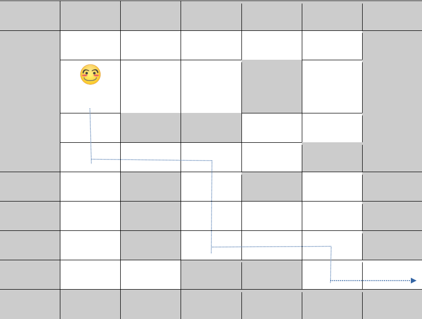

# UNIVERSIDADE FEDERAL DO PARANÁ

# CURSO SUPERIOR DE TECNOLOGIA EM

# ANÁLISE E DESENVOLVIMENTO DE SISTEMAS

# DS- 130 - ESTRUTURAS DE DADOS I – 3 º. PERÍODO

# MÓDULO II – TRABALHO PRÁTICO II

TRABALHO PRÁTICO II

1. Aplicação de Pilha: O problema do labirinto (50 PONTOS)

O objetivo deste exercício é usar uma pilha para implementar uma técnica conhecida
como backtracking (ou retrocesso), frequentemente usada em Inteligência Artificial para
resolver problemas por meio de tentativa e erro. Essa técnica é útil em situações em que,
a cada instante, temos várias opções possíveis e não sabemos avaliar o melhor. Então,
escolhemos uma delas e, caso essa escolha não leve à solução do problema,
retrocedemos e fazemos uma nova escolha.

Para ilustrar o uso dessa técnica, aplicaremos o problema do rato em um labirinto. O rato
está preso no labirinto e precisa achar o caminho que o live a à saída, conforme ilustra a
imagem abaixo

Para tanto, você precisa:

- Declarar uma matriz quadrada 30X30 para representar o labirinto.
- As posições da matriz podem armazenar uma das seguintes marcas: livre, parede,
    visitada ou beco (você pode definir essas marcas como constantes inteiras).
    Inicialmente, toda posição é marcada como livre ou parede, e apenas posições
    livres podem ser alcançadas pelo rato. Quando uma posição livre é alcançada, sua
    marca é alterada para visitada e quando fica determinado que uma posição
    visitada conduz a um beco, sua marca é alterada para beco.
- Toda vez que um labirinto é criado, as bordas da matriz são marcadas como
    paredes e sua configuração interna é definida aleatoriamente. Além disso, a
    posição inicial do rato e a posição de saída do labirinto são marcadas como livres
    e definidas de forma aleatória.
- Para definir a configuração interna da matriz, deve-se usar a função random.
- Para facilitar a visualização do processo de busca da saída do labirinto, ao exibir a
    matriz em vídeo, as posições devem ser marcadas como:
       ▪ livre: será representada por um espaço em branco;
       ▪ parede: será representada por um bloco sólido (ASCII 219);

▪ visitada: será representada por um ponto;
▪ beco: será representada por um bloco pontilhado (ASCII 176);
▪ posição em que o rato se encontra no labirinto, no momento em que ele é
exibido: será representada pelo caracter - ASCII 1 (carinha feliz)
Obervação: A equipe pode escolher outra representação para os elementos do
labirinto.

- Para encontrar a saída do labirinto, aplicar o seguinte algoritmo:
    ▪ Definir (i,j) como posição corrente do rato, que inicialmente é (2,2);
    ▪ Iniciar uma pilha P vazia;
    ▪ Até que a posição corrente (i,j) se torne a posição de saída (n-1, n):
       ◦ Marcar a posição corrente (i,j) como visitada;
       ◦ Se houver uma posição livre adjacente a posição corrente,
          empilhamos a posição corrente e movimentamos o rato para essa
          posição livre;
       ◦ Senão, estamos num beco e precisamos retroceder à última
          posição pela qual passamos para explorar outro caminho. Para
          isso, desempilhamos uma posição de P, que passa a ser a nova
          posição corrente. Caso a pilha esteja vazia, o labirinto não tem
          saída e a busca fracassa.
    ▪ Alcançada a posição de saída a busca termina com sucesso.

Serão avaliados os seguintes itens na implementação da solução desse problema:

- Manipulação de uma pilha encadeada;
- Aplicação de funções, passagem de parâmetro por valor e por referência, retorno
    de função;
- Implementação de todos os elementos especificados acima.

